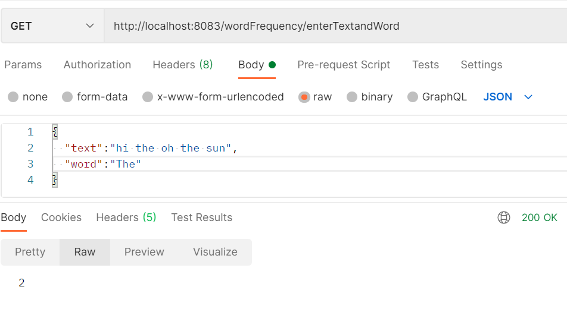

# Word-Count

> [Implementation]  
int calculateHighestFrequency(String text);
Calculates highest frequency of word present in input string case insensitive

>
int calculateFrequencyForWord (String text, String word);
Calculates highest frequency of specific word provided

>
List<WordFrequency> calculateMostFrequentNWords (String text, int n);
In Process ...  
Main logic
Using grouping and partationing need to group words based on int getFrequency();
and the sort in asending order of words

[API Design] 

>
###calculateHighestFrequency  
GET method 
http://localhost:8083/wordFrequency/Yhe Then the Sun The shine the
Response 3

>
###calculateFrequencyForWord

>  

## How to Run
>
<B> Execute tests: </B>  
 `mvn clean install`
>
Tried to complete Code coverage for Acceptance
	
#### Starting application:
>
 `mvn spring-boot:run`  
> App will run on 8083 port
>
http://localhost:8083/swagger-ui.html#/word-frequency-controller
>
Actuator is up
http://localhost:8083/actuator